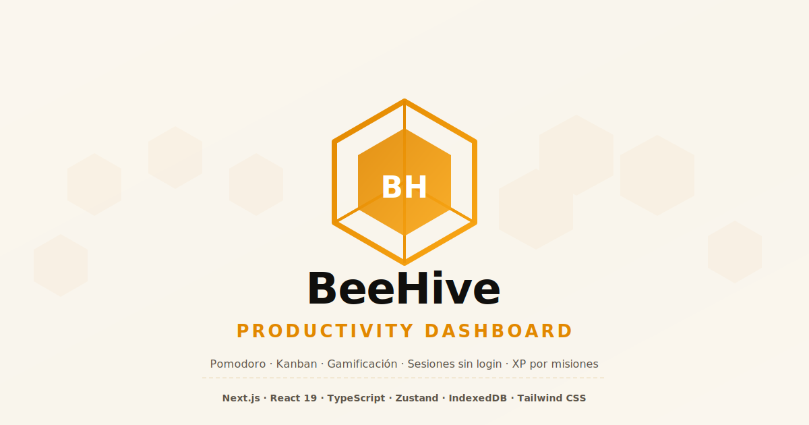

# 🐝 BeeHive — Productivity Dashboard

> Dashboard de productividad gamificado con Pomodoro, Kanban, XP por misiones y autenticación de usuarios.

[](https://nextjs.org)
[](https://react.dev)
[](https://www.typescriptlang.org)
[](https://tailwindcss.com)
[](https://zustand-demo.pmnd.rs)
[-yellow>)](https://dexie.org)
[](https://vitest.dev)
[]()
[]()
[]()
[]()
[]()
[]()
[]()
[]()
[](https://sentry.io)
[]()
[]()
[]()



---

## 📊 Auditorías de Calidad

| Categoría            | Score (Desktop) | Score (Mobile) | Herramienta         |
| -------------------- | :-------------: | :------------: | ------------------- |
| **Rendimiento**      |     99/100     |       92/100        | PageSpeed Insights  |
| **Accesibilidad**    |     90/100      |     90/100     | PageSpeed Insights  |
| **Buenas Prácticas** |     96/100      |     96/100     | PageSpeed Insights  |
| **SEO**              |     100/100     |    100/100     | PageSpeed Insights  |
| **Seguridad**        |      A+ 🏆      |      A+ 🏆     | Mozilla Observatory |

> ✅ **Mozilla Observatory**: A+ (10/10 tests passed) — nonce-based CSP.
> 📊 [PageSpeed Insights](https://pagespeed.web.dev/analysis/https-dashboard-josmarypirela-dev/j4h4zlxmej?form_factor=mobile)

---

## 🎯 Core Web Vitals (Producción - PageSpeed Insights)

### Desktop

| Métrica                      | Valor | Evaluación |
| ---------------------------- | :---: | :--------: |
| **First Contentful Paint**   | 0.2 s |  ✅ Bueno  |
| **Largest Contentful Paint** | 0.6 s |  ✅ Bueno  |
| **Total Blocking Time**      | 20 ms |  ✅ Bueno  |
| **Cumulative Layout Shift**  | 0.01  |  ✅ Bueno  |
| **Speed Index**              | 1.2 s |  ✅ Bueno  |

### Mobile

| Métrica                      | Valor |       Evaluación       |
| ---------------------------- | :---: | :--------------------: |
| **First Contentful Paint**   | 1.6 s |        ✅ Bueno        |
| **Largest Contentful Paint** | 2.9 s |        ✅ Bueno        |
| **Total Blocking Time**      | 20 ms |        ✅ Bueno        |
| **Cumulative Layout Shift**  | 0.01  |        ✅ Bueno        |
| **Speed Index**              | 4.2 s | 🟡 Medio (3.4s - 5.8s) |

> 📱 **Nota**: Métricas obtenidas en condiciones reales de red (Slow 4G, CPU throttled)
> [Ver análisis detallado](https://pagespeed.web.dev/analysis/https-dashboard-josmarypirela-dev/j4h4zlxmej?form_factor=mobile)
>
> 🔒 **Mozilla Observatory**: A+ (10/10) — [Ver reporte](https://observatory.mozilla.org/analyze/dashboard.josmarypirela.dev)

---

## ✨ Funcionalidades

| Funcionalidad              | Descripción                                                                         |
| -------------------------- | ----------------------------------------------------------------------------------- |
| **Pomodoro Timer**         | Temporizador configurable con selector de tarea activa y confirmación de completado |
| **Kanban Board**           | Gestión de tareas con drag & drop (Por hacer → En proceso → Completado)             |
| **Gamificación**           | XP por misiones reclamables con sistema de niveles por rango                        |
| **Misiones por nivel**     | Level 1: 3 misiones básicas · Level 2+: más difíciles y mayor recompensa            |
| **Búsqueda instantánea**   | Filtrado en tiempo real de tareas por título o notas                                |
| **Estadísticas semanales** | Gráficos SVG de tiempo de enfoque y eficiencia por día                              |
| **Proyección**             | Predicción de días restantes según ritmo de trabajo configurable                    |
| **CSV Import/Export**      | Respaldo y restauración de tareas en formato CSV                                    |
| **Sesión sin login**       | Seguimiento por dispositivo con heartbeat e inactivity timeout (demo ready)         |
| **Autenticación**          | Registro e inicio de sesión con nombre, apellido, usuario, email y contraseña       |
| **Password checker**       | Requisitos dinámicos en tiempo real (8+ chars, mayúscula, número, especial) con checklist visual |
| **Forgot / Reset password**| Páginas estilizadas (tema bee) para solicitar restauración y cambiar contraseña con token |
| **Cierre de sesión**       | Botón Sign Out con icono LogOut en sidebar, elimina la sesión del servidor |
| **Persistencia de datos**  | Al iniciar sesión, los datos se guardan en Neon PostgreSQL (sesión persistente)     |
| **Sesión efímera**         | Sin login, los datos se pierden al cerrar la página                                 |
| **i18n**                   | Español e Inglés con cambio en caliente (incluye formularios de auth)               |
| **Markdown Notes**         | Editor de notas por tarea con formato Markdown y vista previa (lazy-loaded)         |

---

## 🚀 Stack técnico

| Capa             | Tecnología                            |
| ---------------- | ------------------------------------- |
| **Framework**    | Next.js 15 (App Router)               |
| **UI**           | React 19 + Tailwind CSS 4 + Motion    |
| **Estado**       | Zustand (store global)                |
| **Persistencia local** | IndexedDB via Dexie.js                |
| **Persistencia cloud** | Neon (PostgreSQL) + Drizzle ORM (con auth) |
| **Autenticación**      | bcryptjs + httpOnly cookies + sesiones en DB |
| **Drag & Drop**  | @dnd-kit                              |
| **Forms**        | react-hook-form + Zod                 |
| **Logger**       | Logger estructurado por contexto      |
| **Tipografía**   | Inter (self-hosted via next/font)     |
| **Tests**        | Vitest (unit) + Playwright (e2e)      |
| **Monitoring**   | Sentry (error tracking + performance) |
| **Orquestación** | Turborepo                              |
| **Quality**      | SonarQube + TypeScript strict + ESLint + Prettier |

---

## 🛠️ Scripts

| Comando          | Descripción                                          |
| ---------------- | ---------------------------------------------------- |
| `pnpm dev`       | Inicia servidor de desarrollo (Turborepo)            |
| `pnpm build`     | Compila para producción (Turborepo con caché)        |
| `pnpm test`      | Tests unitarios con cobertura (104 tests)            |
| `pnpm test:e2e`  | Tests end-to-end con Playwright                      |
| `pnpm typecheck` | Verificación de tipos TypeScript                     |
| `pnpm lint`      | ESLint (flat config, sin circular ref)               |
| `pnpm preflight` | typecheck + lint + test (CI ready)                   |
| `pnpm format`    | Formatea código con Prettier                         |
| `pnpm format:check` | Verifica formato con Prettier                     |
| `pnpm start`         | Inicia servidor de producción (Next.js)          |
| `pnpm test:watch`    | Tests en modo watch (Vitest)                     |
| `pnpm audit:observatory` | Auditoría de seguridad vía Mozilla Observatory |
| `pnpm audit:all`     | typecheck + test + build (auditoría completa)    |

---

## 🧪 Tests

```bash
pnpm test        # Unit + integration (Vitest) — 104 tests, 7 suites
pnpm test:e2e    # E2E (Playwright: Chromium/Firefox/WebKit local, solo Chromium en CI)
pnpm preflight   # typecheck + lint + test (CI pipeline)
```

### Cobertura clave

| Módulo                  | Statements | Branches |
| ----------------------- | :--------: | :------: |
| `store/useHiveStore`    |    95%     |   78%    |
| `hooks/useTasks`        |    100%    |   100%   |
| `components/TaskCard`   |    100%    |   100%   |
| `components/FocusTimer` |    72%     |   56%    |
| `utils/importer`        |    100%    |   91%    |
| `utils/sanitize`        |    100%    |   100%   |

---

## 📁 Arquitectura

```
src/
├── components/     # Atomic Design
│   ├── atoms/      # Badge, HexButton, PollenIndicator, ProgressHex
│   ├── molecules/  # TaskCard (compound component)
│   └── organisms/  # FocusTimer, TaskBoard, Sidebar, StatsChart, etc.
├── hooks/          # useTasks, useBeeStats, useSessionTracker, etc.
├── store/          # Zustand store (useHiveStore)
├── context/        # BeeToastProvider (notificaciones)
├── lib/            # Dexie DB, logger, analytics, sanitize
├── utils/          # CSV export/import, traducciones, sanitize
└── types/          # Tipos compartidos
```

---

## 🚦 CI/CD

### GitHub Actions (`.github/workflows/test.yml` + `.github/workflows/deploy.yml`)

| Job               | Comandos                                   | Artifacts (solo si falla) |
| ----------------- | ------------------------------------------ | ------------------------- |
| **quality**       | `typecheck` → `lint` → `test`              | `coverage/`               |
| **e2e**           | `playwright install chromium` → `test:e2e` | `playwright-report/`      |
| **deploy-staging**| Build + Vercel Preview (branch `develop`)  | —                         |
| **deploy-prod**   | Build + Vercel Production (branch `main`)  | —                         |
| **rollback**      | Rollback manual via `workflow_dispatch`    | —                         |

- `pnpm preflight` para pre-push hook
- **Concurrency**: cancel-in-progress automático por rama (`concurrency.group`)
- **Staging**: deploy automático desde `develop` a Vercel Preview (`amondnet/vercel-action@v25`)
- **Production**: deploy automático desde `main` a Vercel Production (`--prod --prebuilt`)
- **Rollback**: manual vía GitHub Actions (`workflow_dispatch` con `--prod --force`)

---

## 🔐 Autenticación

BeeHive permite a los usuarios registrarse e iniciar sesión para preservar sus datos entre sesiones. Sin autenticación, los datos se almacenan localmente (IndexedDB) y se pierden al cerrar el navegador.

| Característica | Detalle |
|---|---|---|
| **Registro** | Nombre, Apellido, Usuario, Email, Contraseña + Confirmación |
| **Validaciones** | Email único, Usuario único (regex alfanumérico), password: 8+ chars, 1 mayúscula, 1 número, 1 especial |
| **Password checker** | Checklist dinámica en tiempo real con [✓]/[ ] durante el registro; botón deshabilitado si no cumple |
| **Forgot password** | Enlace "¿Olvidaste tu contraseña?" en login → página `/auth/forgot-password` (tema bee) |
| **Restauración** | API genera token (1h expiración), página `/auth/reset-password/[token]` para nueva contraseña |
| **Reset seguridad** | Al restablecer, se invalidan todas las sesiones activas del usuario |
| **Seguridad** | bcryptjs (12 rounds), httpOnly cookies, sesiones con expiración (7 días) |
| **Login** | Por email o username |
| **i18n** | Formularios de auth y páginas de reset en español e inglés |
| **UX** | Botón "Sign In" en la barra lateral siempre visible, logout con icono |

---

## 🐛 Sentry (Monitoreo de Errores)

Sentry está configurado para capturar errores en cliente, servidor y edge:

| Archivo                    | Runtime   | Muestreo |
| -------------------------- | --------- | -------- |
| `sentry.client.config.ts`  | Browser   | 25%      |
| `sentry.server.config.ts`  | Node.js   | 50%      |
| `sentry.edge.config.ts`    | Edge      | 10%      |
| `instrumentation.ts`       | Bootstrap | —        |

Solo se activa en producción (`NODE_ENV=production`).

---

## 📝 Logger

Logger estructurado con niveles y contexto en `src/infrastructure/logger/Logger.ts`:

```typescript
const log = new Logger("MyComponent");
log.info("mensaje", { key: "value" });
log.error("algo falló", err);
```

- Niveles: `debug`, `info`, `warn`, `error`
- `debug` se silencia en producción
- Se puede acceder via alias `@infrastructure/logger/Logger`

---

## 🏗️ Turborepo

Configurado con `turbo.json` para tareas con caché y paralelismo:

| Tarea        | Depende de  | Caché                    |
| ------------ | ----------- | ------------------------ |
| `dev`        | —           | ❌ (persistente)         |
| `build`      | `^build`    | `.next/**`               |
| `lint`       | `^build`    | ❌                       |
| `typecheck`  | `^build`    | ❌                       |
| `test`       | `build`     | `coverage/**`            |
| `preflight`  | typecheck + lint + test | ❌          |

Ejecutar con `pnpm turbo <task>` o directamente `pnpm <task>` (PNPM runner).

---

## 🔐 Variables de Entorno

| Archivo              | Propósito                             |
| -------------------- | ------------------------------------- |
| `.env.example`       | Plantilla con valores por defecto     |
| `.env.local`         | Overrides locales (gitignored)        |
| `.env.development`   | Desarrollo (`NODE_ENV=development`)   |
| `.env.staging`       | Staging (`NODE_ENV=production`)       |
| `.env.production`    | Producción (`NODE_ENV=production`)    |

| Variable                         | Descripción                         | Pública |
| -------------------------------- | ----------------------------------- | :-----: |
| `NEXT_PUBLIC_SITE_URL`           | URL del sitio                       |   ✅    |
| `NEXT_PUBLIC_SENTRY_DSN`         | DSN de Sentry                       |   ✅    |
| `NEXT_PUBLIC_ANALYTICS_ENDPOINT` | Endpoint de analytics               |   ✅    |
| `NODE_ENV`                       | development / production            |   ❌    |
| `LOG_LEVEL`                      | debug / info / warn / error         |   ❌    |
| `LOG_ENDPOINT`                   | Endpoint remoto de logs             |   ❌    |
| `RATE_LIMIT_MAX`                 | Máximo de requests por ventana      |   ❌    |
| `RATE_LIMIT_WINDOW`              | Ventana de rate limit (ms)          |   ❌    |
| `CORS_ORIGINS`                   | Orígenes CORS permitidos            |   ❌    |
| `APP_URL`                        | URL base de la aplicación           |   ❌    |

---

## ♿ Accesibilidad

| Práctica                         | Implementación                                       |
| -------------------------------- | ---------------------------------------------------- |
| **Skip to content**              | Enlace de salto al contenido principal               |
| **ARIA roles**                   | Roles semánticos (`region`, `progressbar`, `button`) |
| **Role progressbar**             | Pomodoro timer con `aria-valuenow` y estado visual   |
| **Focus management**             | Focus visible y orden de tabulación lógico           |
| **Contraste**                    | Paleta de colores con contraste suficiente           |
| **Textos alternativos**          | Iconos decorativos con `aria-hidden`                 |

---

## 📦 Deploy Rápido

```bash
pnpm install && pnpm dev      # Desarrollo
pnpm build && pnpm start       # Producción
```

## 🔗 Enlaces

[](https://dashboard.josmarypirela.dev)
[](https://pagespeed.web.dev/analysis/https-dashboard-josmarypirela-dev/j4h4zlxmej?form_factor=mobile)
